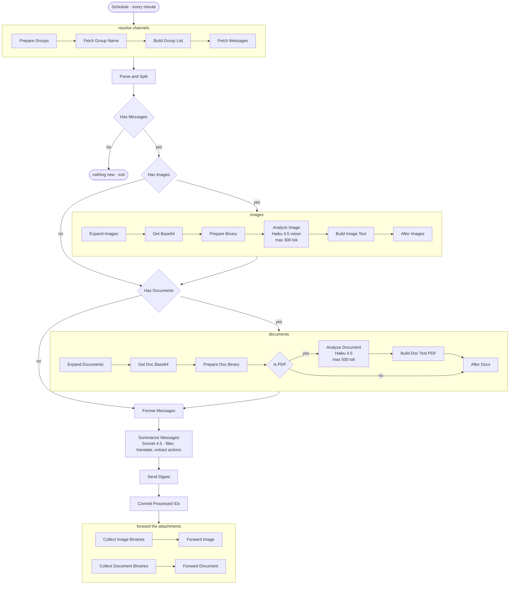

# Channel Digest Agent

An always-on agent that watches noisy group channels, drops the noise, translates what matters,
and returns a structured digest ending in explicit action items.

**Live since May 2026.** Runs every minute. 30-node n8n workflow, WhatsApp connector.
~100 messages a day across six channels. `MEASURED` in production.

---

## The problem

A busy group channel is unreadable. A hundred messages a day across half a dozen channels, most
of them social, a handful carrying a deadline, a payment, a link, or a required action. Reading
everything costs an hour a day. Skipping it costs a missed deadline.

The deployed instance runs against high-volume operational channels written in Hebrew, for a
reader who does not read Hebrew. That is a deliberately hard case: steady traffic, a foreign
language, right-to-left script, mixed media, and real consequences when something slips through.

The same agent fits any team channel — Slack, Telegram, Teams. The input connector changes; the
analysis layer stays as it is.

---

## Architecture

The deployed graph, node for node. Names are the real node names.

Three things in that graph are worth pausing on, and none of them are the model calls.

**Channel names are resolved live, with a frozen fallback.** `Fetch Group Name` asks the API for
the current name of each channel; `Build Group List` takes it, or falls back to a stored label if
the call failed. A digest that labels a message with a raw channel identifier is unreadable, and
the naming call is exactly the kind of dependency that fails alone.

**The two media branches rejoin the text branch, they do not replace it.** `After Images` and
`After Docs` exist only so a cycle with no images and no attachments still reaches
`Format Messages`. Failure isolation is not a setting here, it is the shape of the graph.

**`Commit Processed IDs` sits after `Send Digest`, and the media forward sits after the commit.**
That order is not cosmetic — see below.

The full system prompt is in [`system-prompt.md`](./system-prompt.md). It is the real asset here.

---

## Decisions worth reading

**The model split is a cost decision.** Haiku handles the high-volume, low-judgment work:
describe an image, summarize a PDF. Sonnet runs once per cycle on the assembled transcript,
where the judgment actually lives. Sonnet on every attachment would multiply the bill and leave
output quality where it already was.

**Zero round-trip is the product principle.** The reader must never need to reopen the source
channel. Every other rule in the prompt follows from this one.

**Summarize the context, reproduce the payload verbatim.** Prose gets compressed. Actionable
data gets copied character for character: full URLs, exact amounts, phone numbers, access codes,
deadlines. A summarizer that paraphrases a payment link has destroyed the message. This split is
the single most important instruction in the prompt.

⚠️ **Measured, not asserted.** This is a prompt-level rule, so it was put on a bench:
**[40 labelled cases](./evals)**, exact substring matching, no model judging another model.

The deployed prompt reproduced **73.7 %** of payloads. The failure was not paraphrasing — the
model discarded whole messages as irrelevant, including an assigned ticket number, a cost centre
and an escalation address. A retention rule lifted that to **92.1 %**, and no further prompt
iteration is expected to reach 100 %.

The retention rule is **deployed** — measured first, shipped second.

**That ceiling is the point.** A prompt rule improves behaviour; it does not guarantee it. Which
is why [`validate.mjs`](./evals/validate.mjs) extracts payloads from the input and checks them
against the output. It is written and measured, and **not yet wired into the running workflow**:
so in production this guardrail is still `Constrained`, and the mechanism that would make
structured payloads `Verified` is sitting one integration away. Full numbers, limits and
deployment status are in [`evals/README.md`](./evals/README.md).

**Never invent.** Ambiguous content is translated with a "to be confirmed" marker. Missing
information stays missing. Same level: `Constrained`.

**Explain the empty result.** When nothing qualifies, the agent still states in one sentence what
the channel was discussing, then concludes. This came out of field use: a bare "nothing relevant"
is indistinguishable from a broken pipeline, and it sends the reader back to the channel —
breaking the zero round-trip rule.

**Bilingual rendering is an engineering problem.** Hebrew runs right to left. A line starting
with Hebrew flips the entire block in the messaging client and the digest becomes unreadable.
Every output line therefore opens with a Latin-script label, which forces left-to-right layout.
This one is invisible until you ship to a real reader in a real client.

**The attachments are forwarded, not described away.** A digest that says "a PDF was shared" sends
the reader back to the channel, which breaks the zero round-trip rule. So after the digest goes
out, the images and documents it mentions are forwarded to the same destination. The description
is what lets the reader decide; the file is what lets them act.

**Idempotency by design, and the commit is placed rather than scheduled.** Processed message IDs
are committed after the digest has been sent, never before the work starts. n8n persists
`$getWorkflowStaticData()` even when an execution **fails** — the `workflowExecuteAfter` hook
saves it with no check on status. A node that marks messages processed upfront therefore destroys
them the moment anything downstream errors: the provider rate-limits, and those messages are gone
from every future cycle, silently. Read the memory upstream, carry the candidate IDs through the
payload, commit them at the end. See [`commit-processed-ids.js`](./code/commit-processed-ids.js).

**Truncation is not loss.** Media is capped at 10 images and 5 documents per cycle, because each
one costs a model call. What the cap cuts is deliberately left uncommitted, so the next cycle picks
it up instead of dropping it. A restart, an overlap or a retry never re-sends a digest and never
skips a message.

---

## Code

Three of the fifteen Code nodes, verbatim from the running workflow:

- [`parse-and-split.js`](./code/parse-and-split.js) — reads the raw channel payload, drops protocol
  noise and anything already digested, splits the rest into text, images and documents. Reads the
  processed-ID memory; deliberately never writes to it.
- [`format-messages.js`](./code/format-messages.js) — the fan-in. Three branches converge, two of
  which may not have run at all this cycle. `isExecuted` guards every reference, and the merged
  transcript is re-sorted chronologically before it reaches the model.
- [`commit-processed-ids.js`](./code/commit-processed-ids.js) — nine lines, and the one that took
  a production incident to get right.

## What does not ship here

The workflow export: it carries the host address, credential references and the channel
identifiers. The channel names themselves are personal data belonging to other people, so the node
that holds them stays out of this repository.
