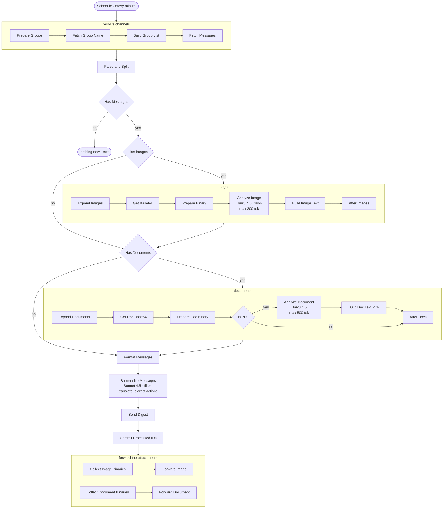

# Channel Digest Agent

An autonomous agent that monitors busy group chats, eliminates noise, translates key discussions,
and generates structured digests featuring explicit action items.

**Live in production since May 2026.** Runs every minute via a 30-node n8n workflow linked to
WhatsApp (~100 messages/day across 6 channels).

## Business use and people

Busy channels make people spend time separating useful information from noise. The digest helps teams
focus on discussions and actions that matter, including messages in a language they do not read
fluently. It prepares a shorter view; the people receiving it still decide priorities and act.

We led this system end to end at 25hour: specifications and product requirements, workflow design,
implementation, evaluation, training, adoption, and operation. The message volume above is observed
usage, not a measured time-saving figure.

---

## The problem

Tracking high-volume chat channels manually consumes time and risks missing critical deadlines or
payments. The deployed setup processes active Hebrew operational channels for non-Hebrew readers,
ensuring key information is highlighted cleanly regardless of language, script, or media mix.

---

## Architecture

```mermaid
flowchart TD
    T([Schedule · every minute]) --> COL

    subgraph COL["resolve channels"]
      direction LR
      PG[Prepare Groups] --> FGN[Fetch Group Name] --> BGL[Build Group List] --> FM[Fetch Messages]
    end

    COL --> PS[Parse and Split]
    PS --> HM{Has Messages}
    HM -->|no| STOP([nothing new · exit])
    HM -->|yes| HI{Has Images}

    HI -->|yes| IMG
    subgraph IMG["images"]
      direction LR
      EI[Expand Images] --> GB[Get Base64] --> PB[Prepare Binary] --> AIM["Analyze Image<br/>Haiku 4.5 vision<br/>max 300 tok"] --> BIT[Build Image Text] --> AFI[After Images]
    end

    HI -->|no| HD{Has Documents}
    IMG --> HD

    HD -->|yes| DOC
    subgraph DOC["documents"]
      direction LR
      ED[Expand Documents] --> GDB[Get Doc Base64] --> PDB[Prepare Doc Binary] --> ISP{Is PDF}
      ISP -->|yes| AD["Analyze Document<br/>Haiku 4.5<br/>max 500 tok"] --> BDT[Build Doc Text PDF] --> AFD[After Docs]
      ISP -->|no| AFD
    end

    HD -->|no| FMT[Format Messages]
    DOC --> FMT

    FMT --> SUM["Summarize Messages<br/>Sonnet 4.5 · filter, translate, extract actions"]
    SUM --> SEND[Send Digest] --> CPI[Commit Processed IDs]

    subgraph MEDIA["forward the attachments"]
      direction LR
      CIB[Collect Image Binaries] --> FWI[Forward Image]
      CDB[Collect Document Binaries] --> FWDOC[Forward Document]
    end
    CPI --> MEDIA
```

Key graph design principles:

**1. Dynamic channel name resolution.** Fetches group names live via API with automatic fallback to
local labels during network outages.

**2. Isolated media processing.** Media processing branches (images, PDFs) run independently and
converge back to text processing without blocking execution on empty cycles.

**3. Transactional message acknowledgment.** Message IDs are committed only after the digest is
successfully delivered to prevent data loss on downstream failures.

Review the full prompt: [`system-prompt.md`](./system-prompt.md).

---

## Design decisions

**Cost-optimised multi-model routing.** Haiku handles high-volume attachment processing, while
Sonnet synthesizes the overall conversation context once per cycle. Operating cost: **~$0.60/day
($15–$20/month)**.

**Reduced channel checking.** The digest reduces routine visits to source channels while keeping the
original discussion available when context is needed. General narrative is
summarized, while critical actionable data (URLs, amounts, phone numbers, codes) is copied verbatim.

**Automated verification layer.** A post-processing script ([`validate.mjs`](./evals/validate.mjs))
checks the structured payloads it can recognize and blocks a digest when one of those is missing.
The [evaluation](./evals) documents what this validator does not catch.

**Bi-directional text handling.** Every generated line opens with a Latin script prefix to force
left-to-right alignment and maintain optimal readability across multi-lingual chats.

**Media forwarding & fault tolerance.** Referenced media files are forwarded directly alongside
digests. Processed states are saved after delivery to reduce the risk of messages being skipped
after a failed send. A delivery that succeeds before the state update may still be repeated.

---

## Code

Core n8n Code nodes:

- [`parse-and-split.js`](./code/parse-and-split.js) — Filters protocol noise and separates text,
  images, and documents.
- [`format-messages.js`](./code/format-messages.js) — Merges parallel execution branches into
  chronological order.
- [`commit-processed-ids.js`](./code/commit-processed-ids.js) — Manages safe state updates for
  processed message tracking.

