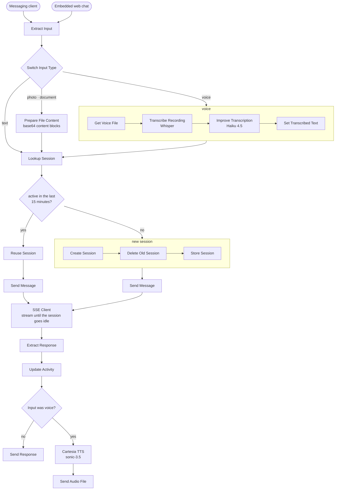

# Multi-Agent Orchestrator

A unified conversational orchestration layer (internal codename: *Hubert*) routing query intents
across integrated enterprise tools via dedicated sub-agents on Anthropic Managed Agents.

| Agent | Surface Area |
|---|---|
| Calendar / Gmail / Google Workspace | Scheduling & Communication |
| Zoho CRM | Pipeline & Contact Management |
| Tavily | Web Search & Intelligence |
| Slack / WhatsApp | Omnichannel Messaging |
| Memo | Knowledge Management (see [Vox Memo](../vox-memo)) |
| Router | Intent Classification & Routing |

---

## Architecture & Cost Optimization

The original monolithic architecture loaded 14 MCP servers (~140 tools, ~57k tokens) into every
request, resulting in high operational costs driven primarily by tool definitions (~70%).

- **Legacy Monolith:** `$0.25 / request` (Tool schemas bloat context windows).
- **Modular Router Architecture:** `~$0.006 / request` (~40x reduction via dynamic sub-agent
  routing).
- **Model Tiering:** Lightweight models handle routing and simple operations; larger models are
  invoked exclusively for complex tasks (e.g., email drafting).

---

## Chat Gateway Architecture

The gateway normalizes multi-modal inputs (text, voice, files), maintains conversation sessions, and
streams real-time responses.

### Key Architectural Decisions

**1. Edge Normalization:** Standardizes heterogeneous client requests into unified payloads before
downstream processing.

**2. Dynamic Session TTL:** Reuses active contexts within a 15-minute sliding window to balance
coherence and token cost.

**3. Streaming Responses:** Utilizes custom Server-Sent Events ([SSE Node](../n8n-sse-node)) to
maintain low-latency delivery across multi-minute agent executions.

**4. Audio Cleanup Pass:** Post-processes raw Whisper transcriptions via Haiku 4.5 to repair proper
nouns and homophones conservatively.

**5. Modality Parity:** Automatically mirrors input modalities (voice-in / voice-out via Cartesia
TTS, text-in / text-out).

### Implementation Files

- [`prepare-file-content.js`](./code/prepare-file-content.js) — Standardizes file attachments into
  base64 blocks via `getBinaryDataBuffer()`.
- [`extract-response.js`](./code/extract-response.js) — Extracts the final agent response from the
  raw SSE stream.
