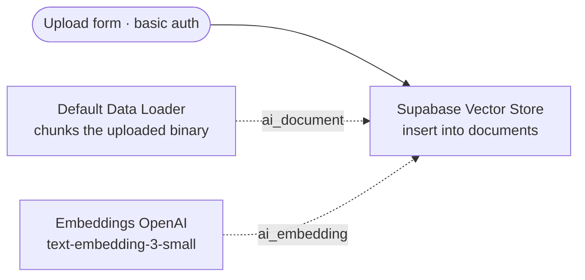

# Voice Knowledge Agent

A real-time voice agent that answers spoken questions from a source corpus. You talk, it
retrieves, it answers, and it answers only from what it retrieved.

**`PROTOTYPE`.** Real-time voice over WebSocket, retrieval-augmented generation over pgvector.

---

## What it is for

A knowledge base nobody queries is a cost centre. Search boxes go unused because typing a precise
query is work, and because the answer arrives as ten documents to read.

Voice removes both frictions. Ask the question the way you would ask a colleague, get the answer
spoken back, at any hour.

Direct applications: front-line support, employee onboarding, product documentation, field staff
with their hands busy.

## Stack

Next.js 16, React 19, TypeScript · real-time voice API over WebSocket · Supabase pgvector with
OpenAI `text-embedding-3-small` for retrieval.

---

## Grounding is the whole point

A voice agent that invents is worse than no agent. Text lets a reader see a hedge and check a
source. Speech carries confidence and leaves no trail — a fabricated answer sounds exactly like a
correct one, and it is gone the moment it is spoken.

So the architecture holds the answer to the corpus:

**Retrieve first, answer second.** Retrieval-augmented generation over the indexed corpus: every
response is built on passages pulled from it. The model composes; the corpus supplies the facts.
Bounding what the model sees is an architectural constraint, and it is the strongest control here.

**Say when there is nothing.** An empty or weak retrieval produces "I don't have that", which is
the correct answer and the one users trust. A plausible-sounding guess destroys the trust the
whole system runs on.

⚠️ **The refusal itself is `Constrained`.** Retrieval bounds what the model sees; nothing
mechanically forces the answer to stay inside what came back. Groundedness here rests on a
prompt-level rule, and measuring it against a labelled question set is exactly what stands between
this prototype and a product.

**The corpus is the boundary.** Coverage is expanded by indexing more sources. It is never
expanded by loosening the constraint.

Three systems attack the same problem, and it is worth being precise about how each one holds.
The [role matching pipeline](../role-matching-pipeline) enforces a `Structural` fact ceiling on generated
documents: removal cannot fabricate, so nothing has to be checked. This agent and the
[channel digest agent](../channel-digest-agent) both sit at `Constrained`: the architecture narrows what the model
sees, and a prompt-level rule asks it to stay inside.

Same principle, three different strengths. Saying so is the point — an unmeasured constraint
described as a guarantee is the first thing a technical reader will test.

---

## Loading the corpus

Retrieval is only half a knowledge agent. The other half is how documents get in, and that half
decides whether the thing survives contact with the people who own the knowledge.

Ingestion runs as its own n8n workflow, deliberately separate from the agent that answers.

**The entry point is a form, not a script.** Whoever owns the knowledge opens a URL, picks a file
and submits it. No n8n access, no database, no CLI, no ticket to a developer. That choice is the
difference between a corpus that grows and one that was loaded once at launch and quietly went
stale — and a stale corpus is worse than a small one, because the agent answers from it with the
same confidence either way.

**The form carries basic auth.** It is the only route that writes into the corpus, and the corpus
is the whole of what the agent is allowed to say. An unauthenticated upload endpoint is not a
missing feature, it is a way to put words in the agent's mouth: anything indexed becomes something
the agent will state as grounded fact. The boundary that makes retrieval trustworthy is only as
strong as the door in front of it.

**Chunking and embedding hang off the insert rather than preceding it.** The data loader and the
embedding model are sub-nodes of the vector store, so splitting the document, computing its vectors
and writing the rows happen as one operation. There is no intermediate state where a document is
half-indexed — chunks present, vectors missing — which is precisely the state that returns empty
retrievals and makes an agent say "I don't have that" about a document somebody watched it accept.

**Same embedding model on both sides.** The corpus is embedded with `text-embedding-3-small`, which
is what the query is embedded with too. Obvious written down, and silent when it is wrong: mismatched
models return no error, only quietly meaningless distances.

**This is the operation that expands coverage.** The agent refuses what it cannot retrieve, so the
answer to "it does not know about X" is always to upload X — never to loosen the constraint. That
is only a workable policy because uploading takes a browser and thirty seconds.

---

## Why it is a `PROTOTYPE`, and not more

The retrieval and voice layers work end to end. Nothing is deployed, nothing runs unattended, and
no cost figure exists — there is no traffic to measure.

Ingestion is the one operational piece that is built, and it is described above. What is missing is
the rest of that half: freshness and re-indexing when a source document changes, deletion of what
has been superseded, and — the one that actually separates this from a product — measuring answer
quality against a labelled question set instead of by impression. The
[channel digest agent](../channel-digest-agent/evals) shows what that measurement looks like when it
is done. Until it is done here, the grounding claim on this page stays `Constrained`.
