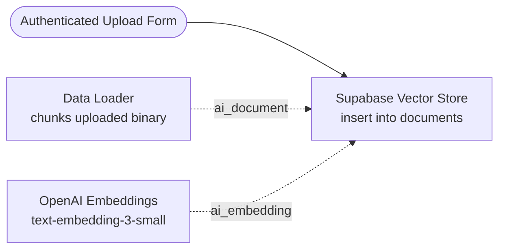

# Voice Knowledge Agent

A real-time voice RAG system that answers spoken queries strictly from an indexed internal corpus.

**Status: Deployed (Internal Access).** Real-time STT/TTS via WebSocket, vector retrieval via
Supabase pgvector.

---

## Use Case & Purpose

Built for field sales reps driving between customer sites who require hands-free, instant access to
technical specs and stock availability. Voice input eliminates manual search friction in a moving
vehicle.

*Note: This repository covers the documentation retrieval pipeline (corpus, indexing, vector
search). Stock checks query live systems of record directly.*

---

## Tech Stack

Next.js 16, React 19, TypeScript · WebSocket real-time voice API · Supabase pgvector with OpenAI
`text-embedding-3-small`.

---

## Grounding & Reliability

Spoken errors carry false confidence and leave no visual trail. Grounding is enforced:

**1. Retrieve First, Answer Second:** The model composes answers exclusively from passages pulled
from the vector store.

**2. Explicit Refusal:** Weak or empty retrievals trigger a clear "I don't have that information."

**3. Network Isolation:** Eliminates external web search to keep the corpus auditable and avoid
unverified figures.

---

## Corpus Ingestion

Ingestion runs as a separate n8n workflow to keep corpus management independent of the answering
agent.

**Key Ingestion Principles:**

- **No-Code Entry Point:** Knowledge owners upload files directly via a basic-auth web form without
  developer access or CLI tools.
- **Atomic Processing:** Splitting, embedding, and vector writing occur in a single operation,
  avoiding partially indexed states.
- **Model-Free File Path:** Documents are ingested raw without model-based rewriting to preserve
  document fidelity.

---

## Cost Architecture

**Retrieval:** Effectively free (~$0.0000004 per query using `text-embedding-3-small` + pgvector
lookup).

**Voice API:** Dominates running costs (billed per minute of audio in/out).

**Scalability:** Expanding the corpus tenfold does not increase per-question cost, scaling cleanly
with user interaction time.

---

## Limitations & Next Steps

Future work includes automated document re-indexing for updated specs and formal eval benchmarks
against labeled test sets.
