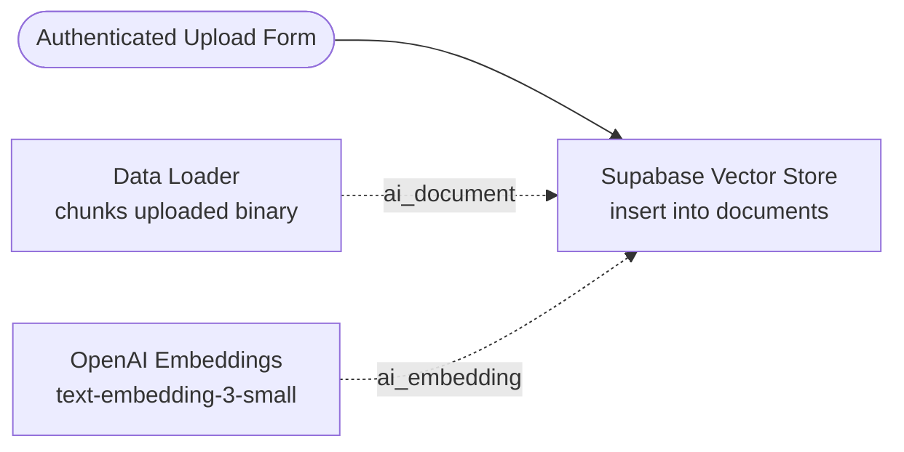

# Voice Knowledge Agent

A voice knowledge system designed to give field sales teams access to product information
without manual search.

**Status: Functional prototype, not deployed for business users.** It uses real-time voice
input and output via WebSocket and vector retrieval via Supabase pgvector.

## Business use and people

Designed for field salespeople who need product information between customer visits, the system
answers spoken questions using company documents. A salesperson would still
verify consequential details and decide what to tell a customer.

We developed the system at 25hour from specifications and product requirements through design
and implementation.

---

## Use Case & Purpose

Designed for field sales representatives who need hands-free access to technical specifications
between customer visits. The prototype tests whether voice input can reduce manual search friction.

*Note: This prototype covers the documentation retrieval pipeline (corpus, indexing, vector
search). A production stock check would need to query a live system of record directly.*

---

## Tech Stack

Next.js 16, React 19, TypeScript · WebSocket real-time voice API · Supabase pgvector with OpenAI
`text-embedding-3-small`.

---

## Grounding & Reliability

Spoken errors can carry false confidence and leave no visual trail. The prototype uses these
controls; formal evaluation is still planned:

**1. Retrieve First, Answer Second:** The model is instructed to compose answers from passages
pulled from the vector store. This instruction is not a guarantee of factual accuracy.

**2. Explicit Refusal:** The agent is instructed to say "I don't have that information" for weak
or empty retrievals.

**3. Network Isolation:** The answering flow does not search the open web, so its documented
sources can be reviewed. This does not by itself guarantee that an answer is correct.

---

## Corpus Ingestion

Ingestion runs as a separate n8n workflow to keep corpus management independent of the answering
agent.

```mermaid
flowchart LR
    F(["Authenticated Upload Form"]) --> VS["Supabase Vector Store<br/>insert into documents"]
    DL["Data Loader<br/>chunks uploaded binary"] -. ai_document .-> VS
    EM["OpenAI Embeddings<br/>text-embedding-3-small"] -. ai_embedding .-> VS
```

**Key Ingestion Principles:**

- **No-Code Entry Point:** Knowledge owners upload files directly via a basic-auth web form without
  developer access or CLI tools.
- **Atomic Processing:** Splitting, embedding, and vector writing occur in a single operation,
  avoiding partially indexed states.
- **Model-Free File Path:** Documents are ingested raw without model-based rewriting to preserve
  document fidelity.

---

## Cost Architecture

**Retrieval cost estimate:** ~$0.0000004 per query for the embedding model, excluding storage,
voice, hosting, and other operating costs.

**Voice API:** Dominates running costs (billed per minute of audio in/out).

**Scalability:** A larger corpus need not increase the embedding charge for each question, though
storage, index maintenance, retrieval performance, and voice usage may change total cost.

---

## Limitations & Next Steps

Future work includes automated document re-indexing for updated specs and formal eval benchmarks
against labeled test sets.

