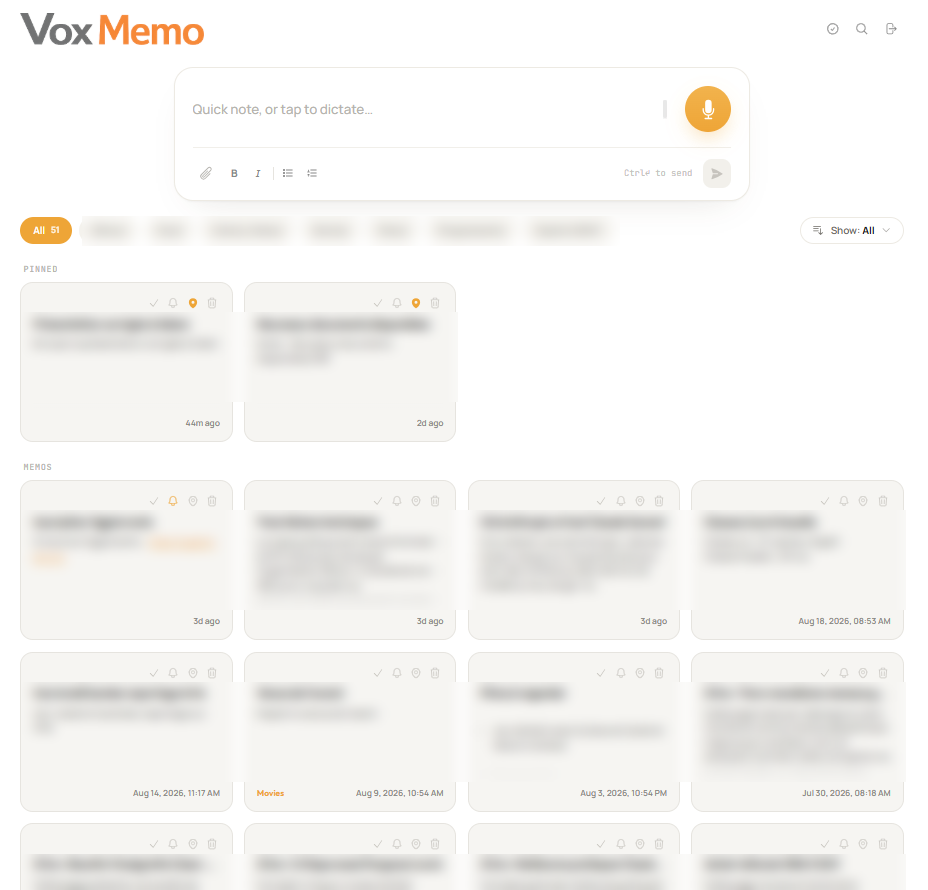

# Vox Memo

A smart note-taking platform for voice and text that automatically titles, files, tags, links, and
indexes entries for semantic search.

**Live at [memo.25hour.io](https://memo.25hour.io)** — Web and native Android app built from a
single codebase.

10,500 lines of TypeScript · 101 commits · 20 API routes · ~62 memos captured / month



*Memo content is blurred; the interface is not. Titles, summaries, tags and the pinned set are
written by the enrichment pipeline.*

---

## Business use and people

Teams lose context when useful notes are hard to find or live only in one person's memory. Vox Memo
makes captured knowledge searchable by meaning, so it can be retrieved and reused in collaboration.
AI handles filing and linking; people decide what to record, share, and use.

We led the product end to end at 25hour, from specifications and product requirements through design,
implementation, training, adoption, and operation. About 62 memos captured per month is a usage
figure. It does not establish how many people or teams use the product.

## Core Purpose

Automates note organization at capture time, making the entire memory corpus searchable by semantic
meaning rather than exact keywords.

---

## Tech Stack

Next.js 16, React 19, TypeScript 5, Tailwind 4 · Vercel (API routes) · Supabase (Auth, Postgres,
pgvector, Storage, Realtime) · Capacitor 8 (Android).

**AI Layer:** OpenAI `gpt-5.4-mini` (enrichment, image analysis, URL summaries, title backfill) and
`text-embedding-3-small` (vectors) · Deepgram Nova-3 (speech-to-text) · Apify (URL crawling).

---

## Async Ingestion Pipeline

```
create memo
  ├─ 1. Crawl   — Extract URLs, scrape content, append summaries
  ├─ 2. Enrich  — Extract title, project, summary, tags, entities, date, priority
  ├─ 3. Embed   — Vectorize content + tags (max 8,000 chars)
  ├─ 4. Link    — Nearest-neighbor search (pgvector edge > 0.75)
  └─ 5. Mark    — Set ai_processed = true
```

Voice notes await STT transcription before step 1. Incomplete jobs are automatically retried via
background cron every 15 minutes (max 5 retries).

---

## Key Architectural Decisions

- **Write-Time Date Resolution:** Parses relative dates ("next Thursday") into explicit timestamps
  upon creation.
- **Meta-Speech Cleaning:** Strips spoken meta-commands ("remind me to...") from the note body while
  storing them as structured attributes.
- **Platform-Agnostic HTTP:** Custom `apiCall()` routes native requests on Android and standard
  fetch on Web.
- **Dual Auth Model:** Cookie sessions on Web and Bearer tokens on Android/API, backed by strict Row
  Level Security (RLS).

---

## Reliability & Fallbacks

Pipeline steps are decoupled so non-critical failures (such as web scraping timeouts) do not prevent
vector embedding and indexing. Asynchronous processing prevents serverless execution timeouts.

---

## Cost Efficiency

The move to OpenAI changed the unit economics. A representative per-memo cost for the current
stack has not yet been measured, so no monthly estimate is published here. Audio transcription
and URL crawling add usage-based costs when needed.

